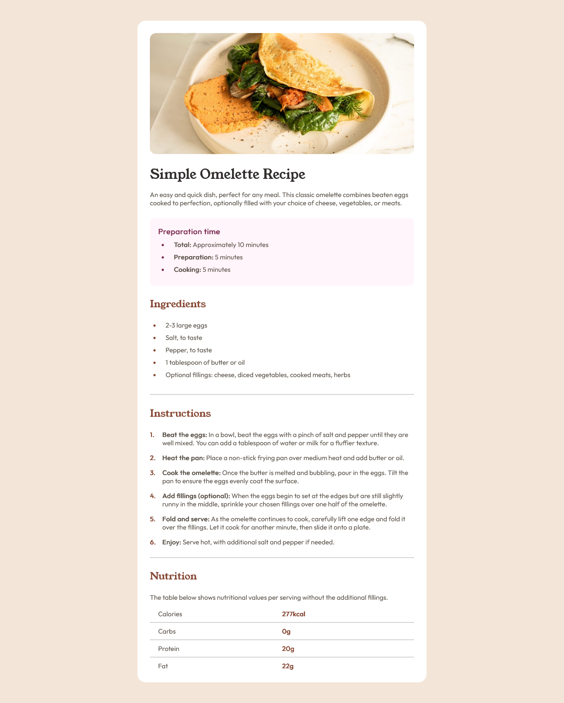

# Frontend Mentor - Recipe page solution

This is a solution to the [Recipe page challenge on Frontend Mentor](https://www.frontendmentor.io/challenges/recipe-page-KiTsR8QQKm). Frontend Mentor challenges help you improve your coding skills by building realistic projects. 

## Table of contents

- [Overview](#overview)
  - [The challenge](#the-challenge)
  - [Screenshot](#screenshot)
  - [Links](#links)
- [My process](#my-process)
  - [Built with](#built-with)
  - [What I learned](#what-i-learned)
  - [Continued development](#continued-development)
- [Author](#author)
- [Acknowledgments](#acknowledgments)

## Overview

### Screenshot

### Links

- Solution URL: [frontend mentor](https://www.frontendmentor.io/solutions/recipe-page-using-html-and-css-hMttlYPnGp)
- Live Site URL: [GitHub pages](https://hypertags.github.io/recipe-page-solution/)

## My process

### Built with

- Semantic HTML5 markup
- CSS custom properties
- Flexbox
- CSS Grid
- Mobile-first workflow

### What I learned

- I learnt how to give a child element a position outside the boundaries of its parent element using the absolute value of the position property.

- I also learnt how to change the styles of the markers of list items.

- I learnt about how to add counter variable to elements.

### Continued development

I would like to focus on using the counter variable and the marker pseudo-element to number elements and style markers respectively when necessary, not forgeting to perfect myself when it comes to positioning elements on the viewport or within an container element.

## Author

- GitHub - [@HyperTags](https://github.com/HyperTags)
- Frontend Mentor - [@HyperTags](https://www.frontendmentor.io/profile/HyperTags)
- LinkedIn - [David Addo](https://linkedIn.com/in/david-addo-6ba707350)

## Acknowledgments

I would like to say a very BIG thank you to Frontend Mentor for providing us an opportunity to learn and build real projects. I would also like to thank myself for being able to complete this project, glory be to God Almighty for His help. I want appreciate Fabian at Coding2Go for his inspiration and consistent update on frontend development. Thank you to you all!